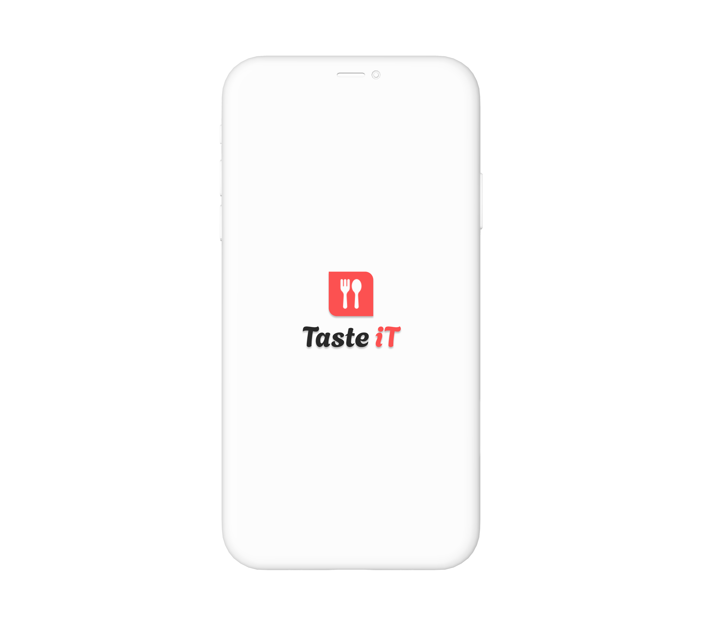
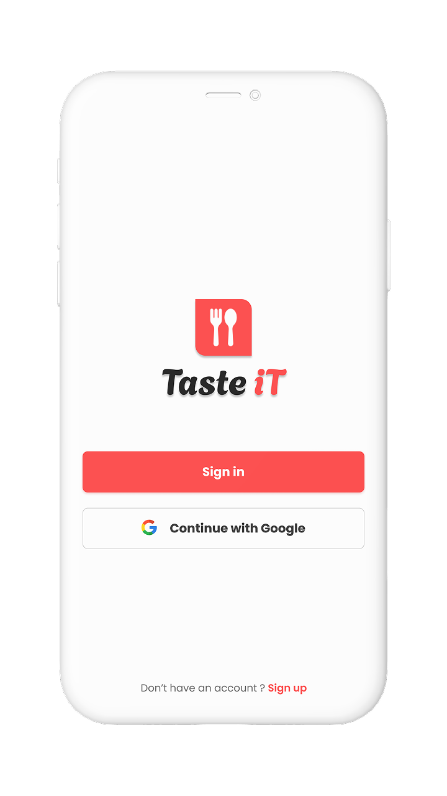
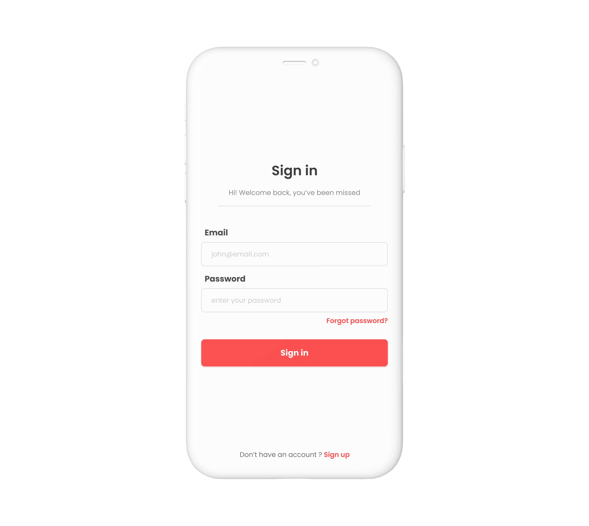
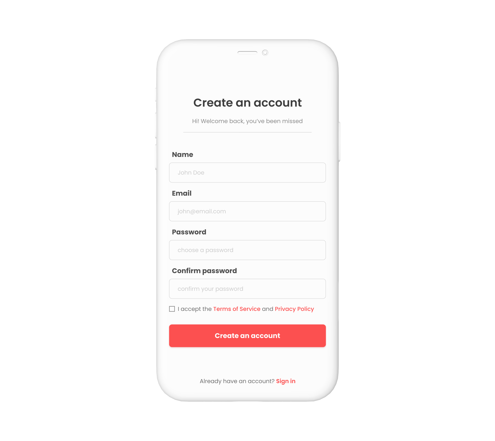
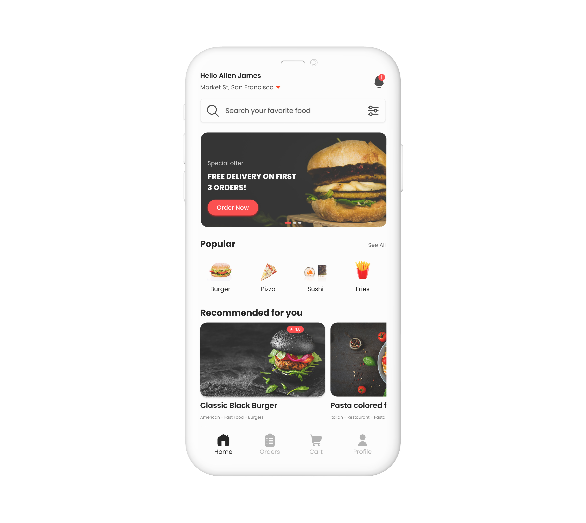
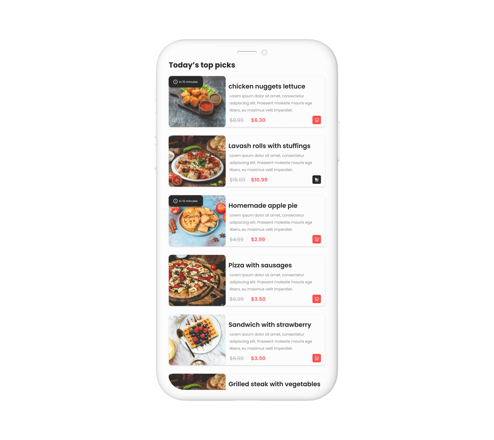
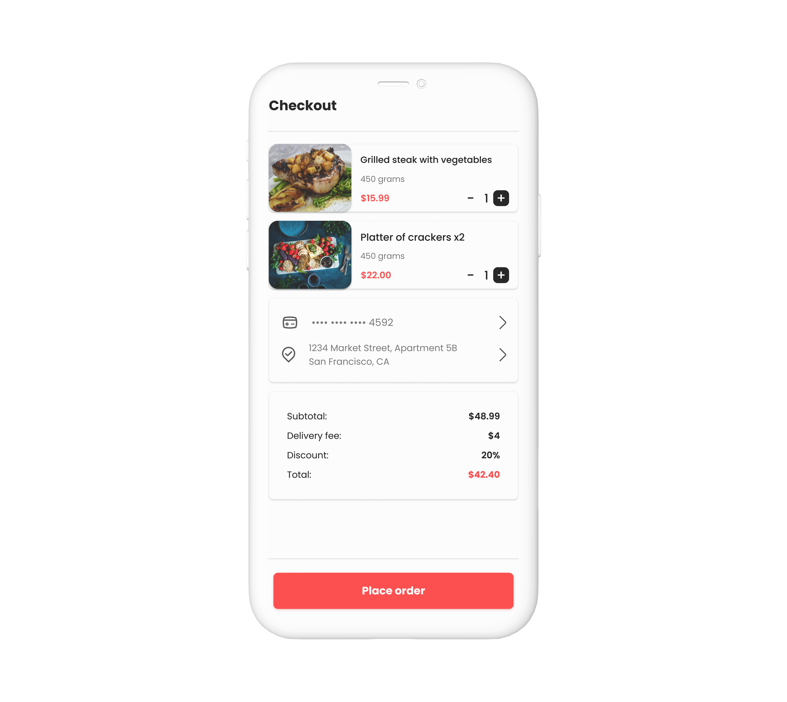
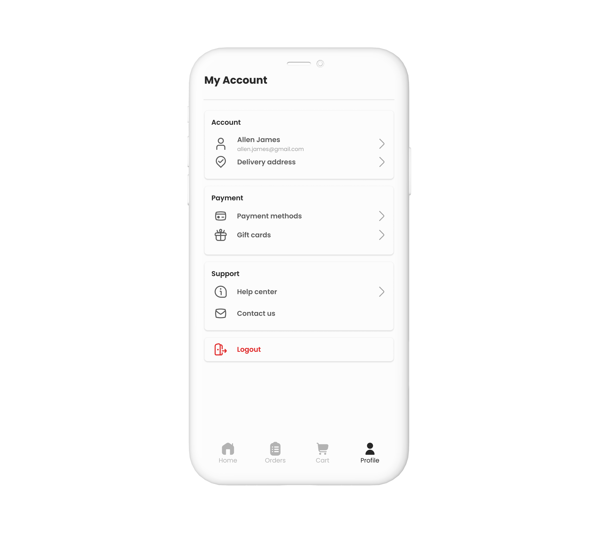

# 🍔 Tasteit

Tasteit is a mobile app for exploring and enjoying meals, providing an intuitive experience to browse dishes, view details, and manage selections efficiently.

---

## ✨ Features

- Browse a variety of meals and dishes  
- View detailed information for each meal  
- Add meals to a cart and adjust quantities  
- Checkout with a clear summary  

---

## 🛠 Tech Stack

- React Native & Expo  
- Firebase Authentication (user login & security)  
- Formik & Yup (forms and validation)  
- Context API for state management  
- React Navigation  
- Figma for UI/UX design

---

## 🧠 What This Project Demonstrates

- Meal-focused app architecture with intuitive navigation  
- Cart and checkout logic in a real-world scenario  
- Form handling and validation with Formik & Yup  
- Reusable components and scalable folder structure  
- UX/UI design implementation from concept to app  

---

📲 **Download**
- Android: [Download APK](https://github.com/NedAbed/TasteitApp/releases/tag/v1.0/)
- iOS: Coming soon 🍏

---

## 📸 Screenshots

  

  

